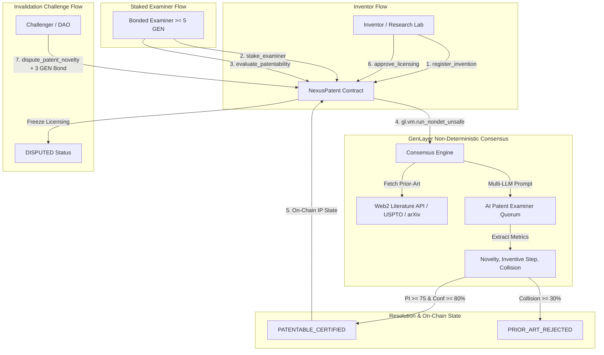

# 🔬 NexusPatent — Decentralized AI Patent & Prior-Art Oracle (DeSci)

> **Autonomous Multi-LLM Quorum & Web2 Literature Consensus for On-Chain Intellectual Property Valuation and Invalidation.**

NexusPatent is a GenLayer Intelligent Contract designed for Decentralized Science (DeSci) and Intellectual Property (IP) tokenization. It replaces centralized, slow, and opaque patent examination processes with deterministic, AI-powered novelty consensus cross-referenced with real-time academic and patent literature feeds (USPTO, EPO, Google Patents, arXiv).

---

## 🏛 Architecture Overview



---

## 📐 Mathematical Formulation

The **Patentability Index ($\text{PI}$)** is computed deterministically by the consensus engine:

$$\text{PI} = \frac{N \times 0.40 + I \times 0.45 + (100 - C) \times 0.15}{100}$$

Where:
- $N \in [0, 100]$: **Novelty Score** (technical uniqueness against known prior art).
- $I \in [0, 100]$: **Inventive Step Score** (non-obviousness to a person having ordinary skill in the art - PHOSITA).
- $C \in [0, 100]$: **Prior-Art Collision Score** (direct overlapping claims).

### Certification Rules
1. **Certified Novel Patent**: $\text{PI} \ge 75 \quad \text{AND} \quad \text{Confidence} \ge 80\% \quad \text{AND} \quad C < 30\%$ $\longrightarrow$ `PATENTABLE_CERTIFIED`.
2. **Prior-Art Rejection**: $C \ge 30\% \quad \text{OR} \quad \text{Decision} = \text{REJECTED}$ $\longrightarrow$ `PRIOR_ART_REJECTED`.
3. **Disputed Review**: Inconclusive or ambiguous claims $\longrightarrow$ `DISPUTED`.

---

## 🔒 Contract Storage & Methods

### Contract Specification
- **Language**: Python (`py-genlayer:1jb45aa8ynh2a9c9xn3b7qqh8sm5q93hwfp7jqmwsfhh8jpz09h6`)
- **Total Methods**: 11 (6 Write, 5 View)

### Public Write Methods
1. `register_invention(invention_id, category, claims_hash, abstract_summary, estimated_valuation)`: Register invention claims.
2. `stake_examiner()` [Payable]: Bond minimum 5 GEN (`5 * 10^18 atto`) to become a certified examiner.
3. `withdraw_examiner_stake(amount)`: Safely withdraw staked collateral with reentrancy safety.
4. `evaluate_patentability(invention_id, technical_claims, embodiment_evidence, prior_art_citations)`: Trigger leader-validator multi-LLM prior-art audit.
5. `dispute_patent_novelty(invention_id, challenge_reason, prior_art_citation_hash)` [Payable]: Post 3 GEN bond to freeze licensing and challenge novelty.
6. `approve_licensing(invention_id, share_denomination)`: Authorize fractional IP tokenization for certified patents.

### Public View Methods
1. `get_invention(invention_id)`: Retrieve full patent state, scores, and licensing parameters.
2. `get_examiner(examiner)`: Query examiner staked bond, review count, and accuracy reputation.
3. `get_records(invention_id)`: Access complete audit history and consensus rationales.
4. `list_inventions()`: List all registered inventions.
5. `get_protocol_overview()`: Protocol statistics and global counters.

---

## 🧪 Testing & Verification

The contract is thoroughly tested using `pytest` and `genlayer-test` in direct VM mode with 21 unit tests covering all edge cases.

```bash
# Lint and validate GenVM contract
genvm-lint check contracts/nexus_patent.py

# Run direct-mode test suite
.venv/bin/pytest contracts/test/ -v
```

### Test Suite Summary:
```text
✓ test_initial_state
✓ test_register_ai_invention
✓ test_register_biotech_invention
✓ test_register_all_valid_categories
✓ test_register_duplicate_rejection
✓ test_register_empty_id_rejection
✓ test_register_invalid_category_rejection
✓ test_register_zero_valuation_rejection
✓ test_examiner_stake_success
✓ test_examiner_stake_zero_rejection
✓ test_examiner_withdraw_stake
✓ test_examiner_withdraw_excessive_rejection
✓ test_evaluate_patentability_novel_certified
✓ test_evaluate_patentability_prior_art_rejected
✓ test_evaluate_patentability_unbonded_examiner_rejection
✓ test_dispute_patent_novelty_success
✓ test_dispute_patent_novelty_insufficient_bond_rejection
✓ test_approve_licensing_success
✓ test_approve_licensing_unverified_rejection
✓ test_examiner_reputation_tracking
✓ test_list_inventions_and_records
============================== 21 passed in 0.40s ==============================
```
