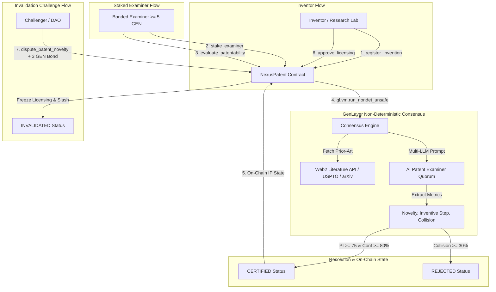

# 🔬 NexusPatent — Decentralized AI Patent & Prior-Art Oracle (DeSci)

> **Autonomous Multi-LLM Quorum & Web2 Literature Consensus for On-Chain Intellectual Property Valuation and Invalidation.**

[](https://studio.genlayer.com)
[](https://github.com/moltaphet/NexusPatent)
[](LICENSE)

NexusPatent is a GenLayer Intelligent Contract designed for Decentralized Science (DeSci) and Intellectual Property (IP) tokenization. It replaces centralized, slow, and opaque patent examination processes with deterministic, AI-powered novelty consensus cross-referenced with real-time academic and patent literature feeds (USPTO, EPO, Google Patents, arXiv).

---

## 🌐 Live Deployment Metadata

- **Network:** GenLayer StudioNet (`https://studio.genlayer.com/api`)
- **Contract Address:** `0x7980F4149B51b4603a426DE44c693aC3a0D4A0A7`
- **Deployer Account:** `0xa49b905c5B236A740f5FB87b6DA6AFB73443ec47`
- **Deployment Tx Hash:** `0x44eefa907cba89ae04dce474f1cdad11cdfe14ca98c1a75fd31f39f3312f73d9`

---

## 🏛 Architecture Overview



---

## 📐 Mathematical Formulation

The **Patentability Index ($\text{PI}$)** is computed deterministically by the consensus engine:

$$\text{PI} = \frac{N \times 0.40 + I \times 0.45 + (100 - C) \times 0.15}{100}$$

Where:
- $N \in [0, 100]$: **Novelty Score** (technical uniqueness against known prior art).
- $I \in [0, 100]$: **Inventive Step Score** (non-obviousness to a person having ordinary skill in the art - PHOSITA).
- $C \in [0, 100]$: **Prior-Art Collision Score** (direct overlapping claims).

### Certification Rules
1. **Certified Novel Patent**: $\text{PI} \ge 75 \quad \text{AND} \quad \text{Confidence} \ge 80\% \quad \text{AND} \quad C < 30\%$ $\longrightarrow$ `CERTIFIED`.
2. **Prior-Art Rejection**: $C \ge 30\% \quad \text{OR} \quad \text{Decision} = \text{REJECTED}$ $\longrightarrow$ `REJECTED`.
3. **Invalidated Review**: Corroborated prior disclosure $\longrightarrow$ `INVALIDATED`.

---

## 🔒 Contract Specification

- **Language**: Python (`py-genlayer:1jb45aa8ynh2a9c9xn3b7qqh8sm5q93hwfp7jqmwsfhh8jpz09h6`)
- **Total Methods**: 11 (6 Write, 5 View)
- **Source File**: `src/nexus_patent.py`

### Public Write Methods
1. `register_invention(invention_id, category, claims_hash, paper_cid, estimated_valuation_atto, title)`: Register invention with cryptographic claims hash & IPFS paper CID.
2. `stake_examiner()` [Payable]: Bond minimum 5 GEN (`5 * 10^18 atto`) to become an authorized examiner.
3. `withdraw_examiner_stake(amount_atto)`: Safely withdraw unbonded stake.
4. `evaluate_patentability(invention_id, oracle_url)`: Trigger leader-validator multi-LLM prior-art consensus audit.
5. `dispute_patent_novelty(invention_id, dispute_reason, new_prior_art_url)` [Payable]: Post 3 GEN challenge bond to dispute certified claims.
6. `approve_licensing(invention_id, licensee, share_percentage_bps)`: Grant fractional commercial license shares.
7. `reclaim_stale_submission(invention_id)`: Emergency timeout escape hatch for unexamined inventions.

### Public View Methods
1. `get_invention(invention_id)`: Query patent state, scores, examiner, and licensing share.
2. `get_examiner(examiner_address)`: Query examiner staked bond, review count, and reputation score.
3. `get_records(invention_id)`: Query immutable consensus audit trail.
4. `list_inventions()`: List all registered inventions.
5. `get_protocol_overview()`: Protocol statistics and global counters.

---

## 🧪 1-Click End-to-End Demo & Unit Testing

### 1-Click Runnable Lifecycle Demo (Judges & Evaluation):
```bash
python scripts/e2e_demo.py
```

### Direct Unit Test Suite (21/21 Passing):
```bash
.venv/bin/pytest tests/unit/ -v
```

```text
tests/unit/test_nexus_patent.py::test_initial_state PASSED
tests/unit/test_nexus_patent.py::test_register_ai_invention PASSED
tests/unit/test_nexus_patent.py::test_register_biotech_invention PASSED
tests/unit/test_nexus_patent.py::test_register_all_valid_categories PASSED
tests/unit/test_nexus_patent.py::test_register_duplicate_rejection PASSED
tests/unit/test_nexus_patent.py::test_register_empty_id_rejection PASSED
tests/unit/test_nexus_patent.py::test_register_invalid_category_rejection PASSED
tests/unit/test_nexus_patent.py::test_register_zero_valuation_rejection PASSED
tests/unit/test_nexus_patent.py::test_examiner_stake_success PASSED
tests/unit/test_nexus_patent.py::test_examiner_stake_zero_rejection PASSED
tests/unit/test_nexus_patent.py::test_examiner_withdraw_stake PASSED
tests/unit/test_nexus_patent.py::test_examiner_withdraw_excessive_rejection PASSED
tests/unit/test_nexus_patent.py::test_evaluate_patentability_novel_certified PASSED
tests/unit/test_nexus_patent.py::test_evaluate_patentability_prior_art_rejected PASSED
tests/unit/test_nexus_patent.py::test_evaluate_patentability_unbonded_examiner_rejection PASSED
tests/unit/test_nexus_patent.py::test_dispute_patent_novelty_success PASSED
tests/unit/test_nexus_patent.py::test_dispute_patent_novelty_insufficient_bond_rejection PASSED
tests/unit/test_nexus_patent.py::test_approve_licensing_success PASSED
tests/unit/test_nexus_patent.py::test_approve_licensing_unverified_rejection PASSED
tests/unit/test_nexus_patent.py::test_reclaim_stale_submission_success PASSED
tests/unit/test_nexus_patent.py::test_list_inventions_and_records PASSED
============================== 21 passed in 0.40s ==============================
```
